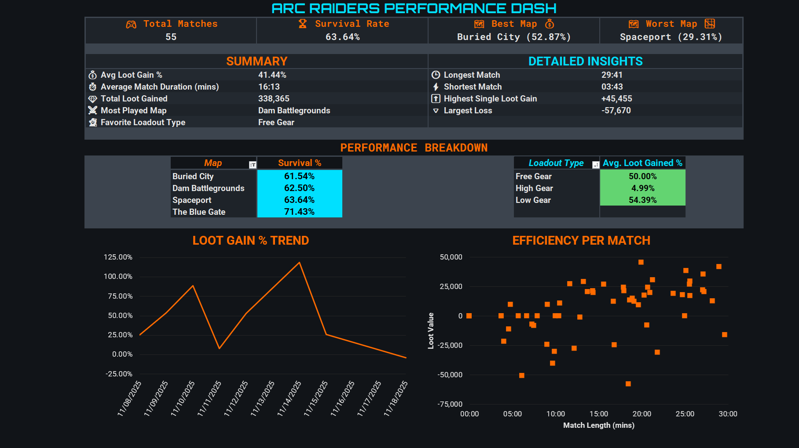

# Arc Raiders Performance Dashboard

An Excel-based performance dashboard built to track and analyze match results from *Arc Raiders*. This project recreates an original Google Sheets dashboard in Microsoft Excel as part of a data analytics portfolio.

The dashboard focuses on gameplay performance, match outcomes, loot efficiency, map trends, and time-based performance patterns.

## Project Overview

This workbook was built to transform manually tracked gameplay data into a visual performance dashboard. Each match record includes details such as match duration, map, loadout type, starting loot value, loot gained, survival outcome, and notes.

The goal of the project is to demonstrate practical dashboard-building skills using a self-collected dataset.

## Dashboard Preview



## Key Features

* Performance summary dashboard
* Match survival rate tracking
* Average loot gain percentage
* Best and worst map performance
* Most played map analysis
* Favorite loadout type analysis
* Longest and shortest match tracking
* Highest single loot gain
* Largest single loot loss
* Daily loot gain percentage trend
* Match duration analysis

## Metrics Tracked

The workbook tracks the following metrics:

* Date
* Match duration
* Map
* Map event
* Event loot indicator
* Loadout type
* Starting loot value
* Loot gained
* Total value
* Loot gained percentage
* Solo/Duo/Trio status
* Survival outcome
* Survival numeric flag

## Skills Demonstrated

This project demonstrates:

* Microsoft Excel dashboard design
* KPI development
* Data cleaning and structuring
* Formula-based analytics
* Time-series analysis
* Conditional logic
* Chart formatting
* Date and time axis formatting
* Data visualization
* Self-directed data collection

## Tools Used

* Microsoft Excel
* Excel Tables
* Structured References
* Dynamic Array Formulas
* Charts
* Conditional Formatting
* Custom Number Formatting

## Workbook Structure

```text
Arc_Raiders_Performance_Dashboard.xlsx
│
├── AR Stats Dash
│   └── Main dashboard and visual summary
│
└── Arc_Raiders_Stats
    └── Source match data and helper calculations
```

## Data Source

The dataset was manually collected from personal gameplay sessions. It is not sourced from a third-party API or external dataset.

## Notes

This dashboard was originally created in Google Sheets and later converted to Microsoft Excel. Some formulas were rebuilt using native Excel functions to improve compatibility and make the workbook cleaner for portfolio use.

## Purpose

This project is part of a broader data analytics portfolio. It is intended to show the ability to collect raw data, define useful metrics, build a clean dashboard, and communicate performance trends visually.

## Author

Charles M. Bettis III<br>
Data Analytics Portfolio Project
